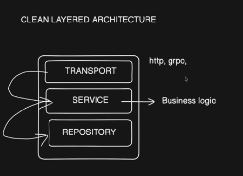

## Clean Layered Architecture



```bash
├──bin/ # compiled go
├── cmd/
│   └── api/
│       └── main.go         # Entry point
├── internal/
│   ├── user/               # Domain-specific logic
│   │   ├── model.go        # Structs (User, CreateUserRequest)
│   │   ├── service.go      # Business logic interface & implementation
│   │   └── store.go        # Database interface & implementation
│   ├── handler/            # Transport - HTTP Handlers (injects services) -> clean way to have gRPC and REST
│   │   └── user_handler.go
│   └── middleware/         # Auth, logging, etc.
├── go.mod                  # Dependency management (Package.json)
├── go.sum          # Lock file (Package-lock.json)
├──docs/ # autogenerated swagger docs
├──scripts/ # scripts for setting up the server.
└──web/ #front-end application code (React, Svelete, etc..)
```

Main principles:
**Separation of concerns**: Separate transport, storage and service layers.. (Controller, Service/Business, Repository)
**Dependency Inversion**: the DIP suggests that classes should rely on abstractions (e.g., interfaces or abstract classes) rather than concrete implementations.
**Adaptability to Change**:
**Focus on Business Value**: Focus on the business value.
